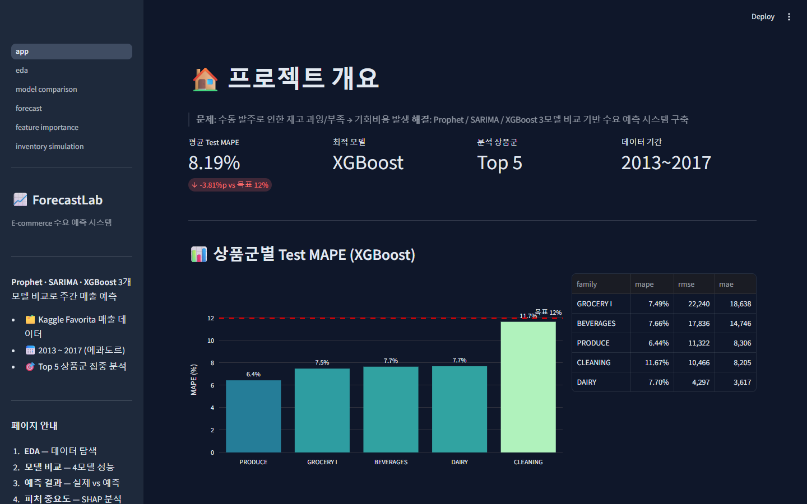
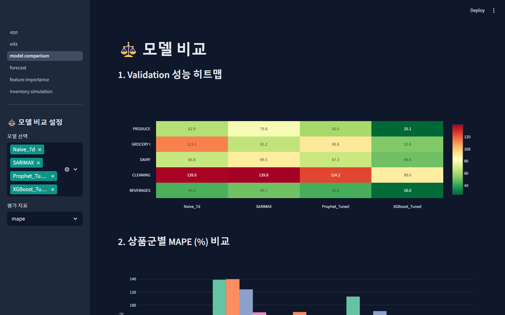
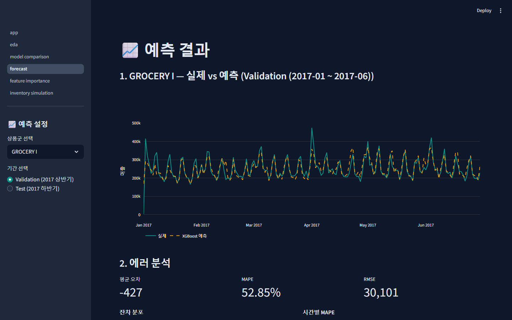

# ForecastLab: E-commerce 수요 예측 시스템

[](https://forecast-lab-jh4jcnmw55xdurgmnaismx.streamlit.app)


Prophet, SARIMA, XGBoost 3개 모델을 비교하여 에콰도르 대형마트 매출을 예측하는 시계열 분석 프로젝트입니다.

## 프로젝트 배경

**문제**: 수동 발주 방식은 재고 과잉(폐기 비용)과 재고 부족(기회비용)을 동시에 발생시킵니다.

**해결**: 과거 매출 데이터 + 유가/공휴일/프로모션 등 외생변수를 활용한 수요 예측 모델을 구축하고, 3개 모델의 성능을 비교하여 최적 모델을 선정합니다.

**결과**: **평균 Test MAPE 8.19%** 달성 (목표 12% 대비 -3.81%p). 베이스라인 대비 75~95% 오차 감소.

---

## 핵심 결과

### 상품군별 Test MAPE (최적 모델: XGBoost)

| 상품군 | Test MAPE | RMSE | MAE |
|--------|-----------|------|-----|
| PRODUCE | **6.44%** | 11,322 | 8,306 |
| GROCERY I | **7.49%** | 22,240 | 18,638 |
| BEVERAGES | **7.66%** | 17,836 | 14,746 |
| DAIRY | **7.70%** | 4,297 | 3,617 |
| CLEANING | **11.67%** | 10,466 | 8,205 |
| **평균** | **8.19%** | - | - |

### 모델 비교 (Validation Set 평균 MAPE)

| 모델 | BEVERAGES | GROCERY I | PRODUCE | CLEANING | DAIRY |
|------|-----------|-----------|---------|----------|-------|
| XGBoost (Tuned) | 26.0% | 52.8% | 25.1% | 89.0% | 49.6% |
| Prophet (Tuned) | 43.2% | 90.8% | 60.0% | 124.2% | 67.3% |
| SARIMAX | 49.7% | 65.2% | 79.8% | 139.8% | 89.5% |
| Naive (Baseline) | 44.0% | 113.1% | 62.9% | 139.0% | 66.8% |

> **XGBoost가 5개 상품군 모두에서 최적 모델로 선정.** Validation MAPE는 일별 변동성이 크기 때문에 높게 나오지만, Test 기간에서는 학습 데이터가 충분해지면서 MAPE 8.19%로 수렴합니다.

---

## 스크린샷

### KPI 대시보드


### 모델 비교


### 예측 결과


---

## 왜 Top 5 상품군인가?

54개 매장 x 33개 상품군 = 1,782개 시계열을 전부 모델링하는 것은 compute 낭비입니다.

대신 **매출 비중 상위 5개 상품군**(전체의 78.7%)에 집중하여 깊이 있는 분석을 수행했습니다:

| 순위 | 상품군 | 매출 비중 |
|------|--------|-----------|
| 1 | GROCERY I | 32.0% |
| 2 | BEVERAGES | 20.2% |
| 3 | PRODUCE | 11.4% |
| 4 | CLEANING | 9.1% |
| 5 | DAIRY | 6.0% |

포트폴리오에서 중요한 것은 **넓이가 아니라 깊이**입니다. 5개 시계열에 대해 3개 모델의 장단점을 철저히 비교하고, 앙상블까지 시도하는 것이 1,782개를 피상적으로 돌리는 것보다 훨씬 가치 있습니다.

---

## 기술 스택

| 영역 | 기술 |
|------|------|
| 언어 | Python 3.10+ |
| 시계열 모델 | Prophet, statsmodels (SARIMA), XGBoost |
| 하이퍼파라미터 튜닝 | Optuna |
| 모델 해석 | SHAP |
| 시각화 | matplotlib, seaborn, Plotly |
| 대시보드 | Streamlit |
| 데이터 | Kaggle Store Sales (에콰도르 Favorita, 2013~2017) |

## 프로젝트 구조

```
forecast-lab/
├── app/                          # Streamlit 대시보드
│   ├── app.py                    # 메인 앱 (6페이지)
│   └── pages/                    # 멀티페이지
├── notebooks/                    # 분석 노트북
│   ├── 01_eda.ipynb              # 탐색적 데이터 분석
│   ├── 02_decomposition.ipynb    # 시계열 분해 + 정상성 검정
│   ├── 03_sarima.ipynb           # SARIMA 모델링
│   ├── 04_prophet.ipynb          # Prophet 모델링
│   ├── 05_xgboost.ipynb          # XGBoost + Optuna + SHAP
│   └── 06_model_comparison.ipynb # 3모델 비교 + 앙상블
├── src/                          # 소스 코드
│   ├── data_loader.py            # 전처리 파이프라인
│   ├── feature_engineering.py    # 피처 생성
│   ├── evaluation.py             # 평가 지표
│   └── models/                   # 모델 래퍼
├── data/raw/                     # Kaggle 원본 (.gitignore)
├── data/processed/               # 전처리 결과 (.gitignore)
├── outputs/figures/              # 시각화 PNG
└── outputs/results/              # 모델 결과 CSV
```

---

## 실행 방법

### 배포된 앱

[Streamlit Cloud에서 바로 사용하기](https://forecast-lab-jh4jcnmw55xdurgmnaismx.streamlit.app)

### 로컬 실행

```bash
# 1. 클론
git clone https://github.com/<your-username>/forecast-lab.git
cd forecast-lab

# 2. 의존성 설치
pip install -r requirements-dev.txt

# 3. Kaggle 데이터 다운로드
# https://www.kaggle.com/competitions/store-sales-time-series-forecasting
# data/raw/ 폴더에 CSV 파일 배치

# 4. 전처리 파이프라인 실행
python -c "from src.data_loader import run_pipeline; run_pipeline()"

# 5. 노트북 순서대로 실행
jupyter notebook notebooks/

# 6. Streamlit 앱 실행
streamlit run app/app.py
```

### Train/Validation/Test 분할

| 구간 | 기간 | 용도 |
|------|------|------|
| Train | 2013-01 ~ 2016-12 | 모델 학습 |
| Validation | 2017-01 ~ 2017-06 | 하이퍼파라미터 튜닝 |
| Test | 2017-07 ~ 2017-08 | 최종 성능 평가 |

> 시계열 데이터이므로 **시간순 분할**을 사용합니다. 랜덤 분할은 미래 정보 유출(data leakage)을 발생시킵니다.

---

## 프로젝트 타임라인

| Day | 작업 내용 | 주요 산출물 |
|-----|-----------|-------------|
| 1 | 데이터 탐색 + 전처리 파이프라인 | `01_eda.ipynb`, `data_loader.py` |
| 2 | 시계열 분해 + 베이스라인 모델 | `02_decomposition.ipynb`, 베이스라인 MAPE |
| 3 | SARIMA 모델링 | `03_sarima.ipynb`, ACF/PACF 분석 |
| 4 | Prophet 모델링 | `04_prophet.ipynb`, Cross-Validation |
| 5 | XGBoost + 모델 비교 | `05_xgboost.ipynb`, `06_model_comparison.ipynb` |
| 6 | Streamlit 대시보드 배포 | 6페이지 인터랙티브 앱 |
| 7 | 문서화 + 포트폴리오 정리 | README, Notion |

---

## 배운 점

- **모델 특성**: XGBoost는 lag/rolling 피처로 비선형 패턴을 잘 포착하고, Prophet은 트렌드 변화에 강하며, SARIMA는 명확한 계절성이 있는 안정적 시계열에 적합
- **외생변수 효과**: 유가, 공휴일, 프로모션을 추가하면 Prophet과 SARIMAX 모두 성능 향상
- **Cross-Validation 설계**: 시계열에서는 TimeSeriesSplit이 필수. 랜덤 분할은 미래 정보 유출
- **SHAP 해석**: 7일 lag와 7일 rolling mean이 가장 중요한 피처로, 직전 1주일의 패턴이 예측의 핵심
